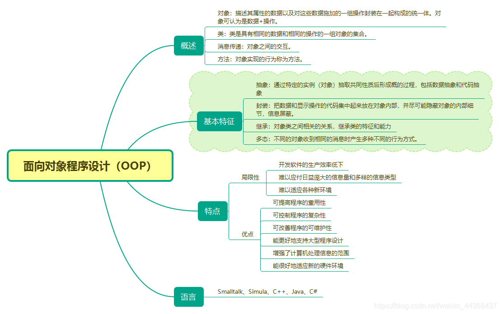

## **剖析面向对象和面向过程**

​	先说**面向过程**呢，就好比你要做一顿饭。你得先买菜、洗菜、切菜、炒菜，一步一步按顺序来。每一步都是一个具体的操作，就像一个个单独的任务。你得清楚地知道先干啥后干啥，数据就像是菜呀、调料呀这些东西，在不同的步骤里被各种操作摆弄。这种方式呢，对于简单的事儿挺直接的，你很清楚整个流程是咋回事。但是如果事儿变得复杂了，比如说你要做一大桌子菜招待很多人，那各种步骤就会变得很混乱，改一个地方可能就得动好多地方，维护起来就麻烦啦。

​	再说说**面向对象**哈。还是做饭这个事儿，现在咱把做饭的各种东西都看成对象。比如说有个 “锅” 的对象，它有自己的属性，像大小、颜色啥的，还有自己的方法，比如 “加热”“煮东西”。还有 “菜” 的对象，有 “种类”“新鲜度” 这些属性，也有 “切”“炒” 这些方法。你做饭的时候呢，就是让这些对象互相配合。如果要改个啥，比如说换个大锅，那你就直接改锅这个对象就行，其他的对象不受影响。这种方式呢，比较适合复杂的事儿，因为每个东西都独立又能互相配合，维护起来容易，也容易扩展新功能。

下面给出稍微正式一点的定义：

​	**面向对象**程序设计（OOP）是一种新的程序设计范型。程序设计范型是指设计程序的规范、模型和风格，它是一类程序设计语言的基础。

​	**面向过程**程序设计范型是使用较广泛的面向过程性语言，其主要特征是：程序由过程定义和过程调用组成（简单地说，过程就是程序执行某项操作的一段代码，函数就是最常用的过程）。

​	面向对象程序的基本元素是对象，面向对象程序的主要结构特点是：第一，程序一般由类的定义和类的使用两部分组成；第二，程序中的一切操作都是通过向对象发送消息来实现的，对象接收到消息后，启动有关方法完成相应的操作。

既然说到这里就让我们下面再多来了解一些相关的概念:

**对象：**描述其属性的数据以及对这些数据施加的一组操作封装在一起构成的统一体。对象可认为是数据+操作。

**类：**类是具有相同的数据和相同的操作的一组对象的集合。

**消息传递：**对象之间的交互。

**方法：**对象实现的行为称为方法。

**面向对象程序设计的基本特征：**抽象、封装、继承、多态。

