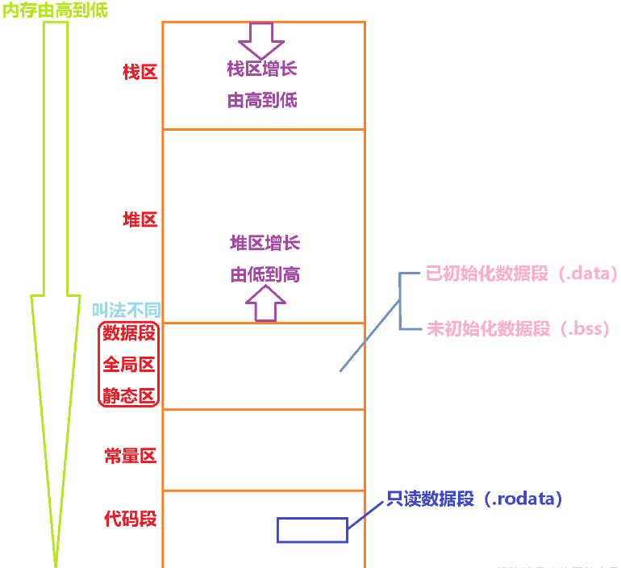

## 内存分区

在 C++ 中，程序的内存通常被分为以下几个主要区域：




下面来详细说说这几个区：

### **栈**

1. **定义与特点**：

   - 栈区向地址减小的方向增长
   - 栈是一种后进先出（LIFO）的数据结构，用于存储局部变量、函数参数、函数返回地址等。
   - 栈的内存分配和释放是由编译器自动管理的，当一个函数被调用时，其局部变量在栈上分配内存，函数执行结束后，这些内存自动被释放。
   - 栈的空间相对较小，通常在几兆字节到几十兆字节之间。

2. ### **示例**：

```cpp
void myFunction() {
    int x = 10; // x 存储在栈上
}

int main() {
    myFunction();
    return 0;
}
```

在这个例子中，函数`myFunction`的局部变量`x`在栈上分配内存，当函数执行结束后，`x`所占用的内存自动被释放。

### **堆**

1. **定义与特点**：
   - 堆区向地址增大的方向增长
   - 堆是一块动态分配的内存区域，用于存储程序在运行时动态分配的对象和数据结构。
   - 堆的内存分配和释放由程序员手动管理，使用`new`运算符在堆上分配内存，使用`delete`运算符释放内存。
   - 堆的空间相对较大，可以根据程序的需要动态增长。
2. **示例**：

```cpp
int main() {
    int* ptr = new int(10); // 在堆上分配一个整数
    delete ptr; // 释放堆上的内存
    return 0;
}
```

在这个例子中，使用`new int(10)`在堆上分配一个整数，并将其地址存储在指针`ptr`中。当不再需要这个整数时，使用`delete ptr`释放堆上的内存。

### **全局 / 静态存储区**

1. **定义与特点**：
   - 全局 / 静态存储区用于存储全局变量、静态变量和常量。
   - 全局变量在程序的整个生命周期内都存在，并且可以被程序的任何部分访问。静态变量在声明它的文件或函数内部可见，并且在程序的整个生命周期内保持其值。
   - 常量也存储在全局 / 静态存储区，但它们的值在程序运行期间不能被修改。
2. **示例**：

```cpp
int globalVariable = 10; // 全局变量存储在全局/静态存储区

void myFunction() {
    static int staticVariable = 20; // 静态变量存储在全局/静态存储区
}
```

在这个例子中，全局变量`globalVariable`和静态变量`staticVariable`都存储在全局 / 静态存储区。

### **常量存储区**

1. **定义与特点**：
   - 常量存储区用于存储常量数据，如字符串常量、常量整数等。
   - 这些数据在程序运行期间不能被修改，并且通常存储在只读内存中。
2. **示例**：

```cpp
const char* str = "Hello, world!"; // 字符串常量存储在常量存储区
```

在这个例子中，字符串常量`"Hello, world!"`存储在常量存储区。

### **代码区**

1. **定义与特点**：
   - 代码区用于存储程序的机器代码，即程序的指令。
   - 这个区域是只读的，不能被修改。
2. **示例**：

```cpp
int main() {
    // 程序的指令存储在代码区
    return 0;
}
```

在这个例子中，`main`函数的指令存储在代码区。

总之，了解 C++ 的内存分区对于理解程序的内存管理和优化非常重要。在编写 C++ 程序时，应该合理地使用栈、堆和全局 / 静态存储区，避免内存泄漏和其他内存管理问题。

