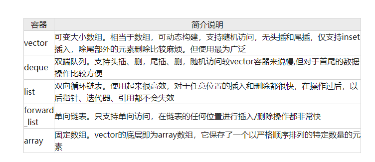
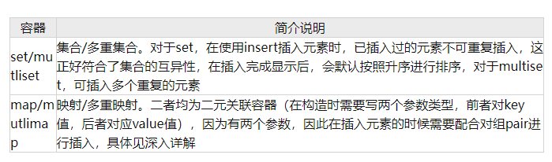
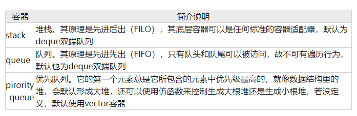

## 什么是容器？

​	容器呢，就是可以承载，包含元素的一个器件，它是STL六大组件之一，是容器、算法、迭代器中最重要也是最**核心**的一部分。

## STL中各大容器的结构与分类

## 顺序性容器

### 什么是顺序性容器？

​	顺序性容器就是将一组具有相同类型的元素以严格的线性形式组织起来

### 有哪些顺序性容器？

​	这里给大家整理成了一个表格的形式，如下表所示🐶

### 顺序性容器在什么场合使用？

​	一般大多数的题目都可以使用vector容器，除非有特定需求使用其他容器更加合理方便；

​	如果需要在一串数字的头尾进行操作，偏向deque，对于较中间的元素操作，不推荐；

​	对于中间的元素插入或删除，可采用forward_list（单向链表）或list（双向链表），不需要移动元素，只需改变相关结点的指针域即可；

## 关联式容器

### 什么是关联式容器？

​	    关联式容器每一个元素都有一个键值（key），对于二元关联容器，还拥有实值（value）容器中的元素顺序不能由程序员来决定，有set（集合）和map（映射）这两大类，它们均是以RB-Tree（red-black tree，红黑树）为底层架构。

### 有哪些关联式容器？

​	同样，以表格的形式呈现，如下表所示

### 关联式容器在什么场合使用？

​	如果只负责查找内容，具体到某个单位，使用场景比如对手机游戏的个人的计分的存储，可以使用set或mutliset

​	如果需要同时放入容器的数据不止一个，并且是不同类型，比如一个为整型int,一个为string字符串型，就可以考虑使用map或mutlimap

## 容器适配器

### 什么是容器适配器？

​	容器适配器是一个封装了序列容器的一个类模板=，它在一般的序列容器的基础上提供了一些不同的功能。之所以称为容器适配器，是因为它是适配容器来提供其它不一样的功能。通过对应的容器和成员函数来实现我们需要的功能

### 有哪些容器适配器？

​	不必多说，看表

### 容器适配器在什么场合使用？

- 对于 stack 堆栈，在我们日常生活中类似于坐地铁、电梯；
- 对于 deque 队列，在我们日常生活中类似于排队打饭；
- 对于 pirority_queue，因为其本质是堆，可以考虑解决一些贪心问题；

具体容器的深入剖析与详解

